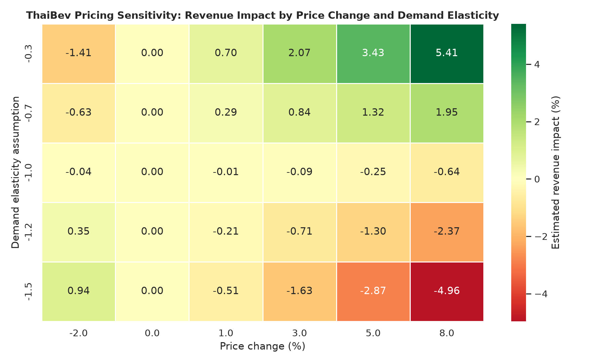

# ThaiBev Commercial Demand & Revenue Forecasting

**Pricing analytics case study for CPG beverage demand, revenue sensitivity, and leak-free forecasting.**

This project reframes Thai Beverage Public Company Limited (`Y92.SI`) from a pure stock-price forecasting exercise into a **commercial analytics project** relevant to Pricing Analyst, Revenue Analyst, Commercial Analyst, and FP&A roles. It combines public Thai beer-sales data, ThaiBev market data, macroeconomic indicators, and pricing-scenario modeling to evaluate how demand and market signals can support revenue planning.

---

## Business Question

How can beverage-market demand, macroeconomic indicators, and realistic pricing assumptions support commercial revenue planning for a diversified beverage company like ThaiBev?

The project answers this through three linked workflows:

1. **Demand & market trend analysis** using monthly Thailand beer-sales data.
2. **Leak-free forecasting** using stock/macro signals with publication-delay controls.
3. **Pricing and revenue scenario analysis** using price-change and demand-elasticity assumptions.

---

## Pricing Analyst Relevance

This project maps directly to pricing and revenue analytics responsibilities:

- Demand forecasting and trend analysis
- Revenue sensitivity modeling
- Price-elasticity scenario planning
- Market and macro driver evaluation
- Forecast accuracy measurement
- Business-facing interpretation and recommendations
- Executive-ready charts, tables, and assumptions documentation

**Resume-ready project title:**

> ThaiBev Commercial Demand & Revenue Forecasting

**Resume bullet:**

> Developed a pricing analytics case study for ThaiBev using Python, demand forecasting, macroeconomic drivers, leak-free time-series validation, and price-elasticity scenarios to estimate revenue impact across base, upside, and downside commercial cases.

---

## Repository Contents

| File | Description |
| :--- | :--- |
| `thaibev_stock_forecasting.ipynb` | Main analysis notebook with leak-free daily/monthly forecasting and commercial scenario section. |
| `pricing_revenue_scenario.py` | Standalone pricing-sensitivity script that creates the revenue impact table and heatmap. |
| `outputs/pricing_revenue_sensitivity.csv` | Scenario output table across price-change and elasticity assumptions. |
| `outputs/pricing_revenue_heatmap.png` | Revenue impact heatmap for pricing analysis. |
| `beer_sales_monthly.csv` | Monthly Thailand beer-sales data from `2016-01` to `2023-03`. |
| `requirements.txt` | Python dependencies. |

---

## Data Sources and Business Context

| Data | Business Use |
| :--- | :--- |
| ThaiBev stock price (`Y92.SI`) | Public market proxy for investor expectations and company valuation. |
| Thailand monthly beer sales | Industry demand proxy for domestic beverage consumption. |
| Straits Times Index (`^STI`) | Singapore-listed equity market benchmark. |
| iShares MSCI Thailand ETF (`THD`) | Thai domestic equity-market proxy. |
| SGD/THB FX (`SGDTHB=X`) | Currency factor because ThaiBev trades in SGD while key demand is THB-linked. |
| COVID regime indicator | Captures the 2020 alcohol-sales shock and demand disruption. |

> Important: Thailand nationwide beer sales are **not ThaiBev revenue**. ThaiBev is a diversified beverage conglomerate with domestic spirits, non-alcoholic beverages, food franchises, Sabeco in Vietnam, and international spirits assets. Beer sales are used as a **market demand proxy**, not as a direct revenue statement.

---

## Methodology

### 1. Leak-Free Forecasting Controls

The original moving-average baseline risked lookahead leakage by using same-period target information. This version fixes that by shifting all baseline and technical features before forecasting.

Example correction:

```python
Close_ma_2 = Close.shift(1).rolling(2).mean()
Close_ema_5 = Close.shift(1).ewm(span=EMA_SPAN, adjust=False).mean()
```

### 2. Publication-Delay Modeling

Monthly beer-sales data is not available at the exact month-end decision date. The project models realistic reporting delays:

- `sale_lag_1`: optimistic one-month lag
- `sale_lag_2`: conservative two-month lag
- `sale_yoy_growth_lag_2`: deseasonalized year-over-year demand growth using available data only
- `sale_rolling_3m_lag_2`: smoothed lagged demand proxy

### 3. Forecasting and Ablation

The forecasting notebook compares:

- Lag-1 price baseline
- Leak-free moving average and EMA baselines
- Linear regression
- ARIMA / exponential smoothing
- Ridge / ElasticNet monthly return models
- SARIMAX with exogenous beer-sales growth

### 4. Pricing and Revenue Scenario Analysis

Because public data does not include transaction-level prices, margins, or SKU-level volumes, the pricing section uses **transparent scenario assumptions**:

- Price-change assumptions: `-2%`, `0%`, `+1%`, `+3%`, `+5%`, `+8%`
- Demand elasticity assumptions: `-1.5`, `-1.2`, `-1.0`, `-0.7`, `-0.3`
- Revenue impact formula:

```text
Revenue multiplier = (1 + price_change) × (1 + elasticity × price_change)
Revenue impact % = Revenue multiplier - 1
```

Example:

```text
If price increases by 3% and demand elasticity is -0.7,
estimated volume change = -2.1%,
estimated revenue impact ≈ +0.84%.
```

---

## Pricing Scenario Output

Run:

```bash
python pricing_revenue_scenario.py
```

This produces:

- `outputs/pricing_revenue_sensitivity.csv`
- `outputs/pricing_revenue_heatmap.png`



---

## Key Findings

1. **Leakage matters**
   - Once target leakage is removed, simple random-walk style baselines become difficult to beat in daily price forecasting.

2. **Beer sales data has modest but useful signal**
   - Beer-sales growth is not a high-frequency trading signal, but it can support commercial context and scenario planning.

3. **Publication delays change the business interpretation**
   - A pricing or revenue analyst must use only information available at the decision date.

4. **Small-sample discipline is critical**
   - Monthly public data has limited sample size, so simple regularized models and SARIMAX are more credible than deep learning.

5. **Scenario modeling is more useful for pricing roles than stock prediction alone**
   - The elasticity heatmap translates analytics into a business decision framework: what price increase range may protect revenue under different demand responses?

---

## Installation

```bash
pip install -r requirements.txt
```

---

## Usage

Run the pricing scenario model:

```bash
python pricing_revenue_scenario.py
```

Open the main notebook:

```bash
jupyter notebook thaibev_stock_forecasting.ipynb
```

---

## Suggested Next Improvements

- Add SKU/channel-level simulated data to model mix, margin, discounting, and promotion effects.
- Build a Streamlit dashboard for pricing-scenario exploration.
- Add tourist-arrival data, CPI, excise-tax changes, and disposable-income proxies.
- Add walk-forward validation for monthly return and demand models.
- Create a short business memo summarizing pricing recommendation, risks, and assumptions.

---

## Project Positioning

This is not just a stock prediction notebook. It is a **pricing and revenue analytics case study** showing how to:

- clean and document business data,
- avoid leakage,
- benchmark models honestly,
- translate forecasts into commercial scenarios,
- communicate insights for pricing and revenue decisions.
